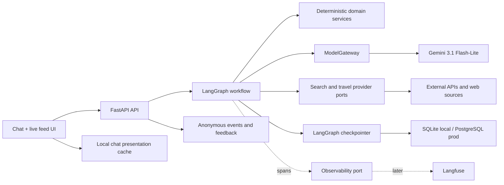
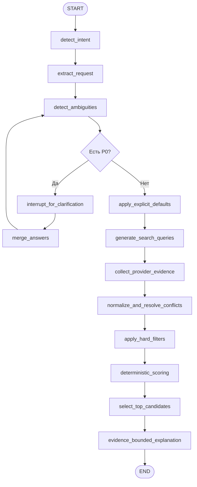

# Architecture

Статус: proposed for MVP.

## Архитектурный стиль

Модульный монолит с одним FastAPI process и одним LangGraph workflow. Внутри — domain/application/provider boundaries. Это сохраняет заменяемость внешних интеграций без operational complexity микросервисов.

## Startup lifecycle

FastAPI lifespan создаёт и закрывает long-lived resources в определённом порядке:

1. validated settings;
2. shared async HTTP client with explicit timeouts;
3. checkpointer/database resources;
4. search/travel provider adapters;
5. one `ModelGateway` instance or explicit disabled/demo adapter;
6. observability adapter, initially no-op if unconfigured;
7. compiled graph using these ports.

API handler не собирает зависимости вручную и не создаёт клиентов на каждый запрос. Graph state не содержит сами resources — только сериализуемое состояние запроса.

## Graph state

State — versioned, JSON-serializable contract. Предполагаемые группы полей:

- identity: request_id, session_id/thread_id, state_schema_version;
- input: raw_query, clarification_answers;
- conversation: bounded query history, question history и previous normalized request;
- intent: parsed TravelRequest, ambiguities, assumptions;
- search: generated queries, raw provider results, provider warnings;
- candidates: normalized candidates, evidence, conflicts;
- decision: rejected candidates/reasons, scoring weights, scored candidates;
- output: response status, recommendations, warnings;
- operational: stage attempts and error codes, но не secrets и не live clients.

Большие полные документы не должны бесконтрольно копироваться в каждый checkpoint. В state хранятся нормализованные excerpts и IDs; raw payload при необходимости уходит в отдельное bounded storage.

## Workflow

Это не ReAct loop и не multi-agent graph. Conditional edges известны заранее. LLM используется только там, где нужен язык или structured extraction; filters, weights, calculations и final ordering выполняет Python.

## Clarification и resume

- P0 приводит к LangGraph `interrupt` с JSON-serializable массивом максимум из трёх вопросов.
- Клиент получает `needs_clarification` и сохраняет opaque session ID.
- Следующий API call возобновляет тот же `thread_id` с answers.
- Узел с interrupt не выполняет non-idempotent side effects до паузы: при resume LangGraph начинает узел заново.
- Ответы валидируются, merge не затирает исходно подтверждённые значения неявно, ambiguity detection запускается повторно.

## Follow-up refinement

- Новый message в завершённом thread запускает новый graph turn с `previous_request`.
- Structured extraction возвращает только explicit patch и список явно снятых ограничений.
- Merge выполняется детерминированно; `null` в patch не удаляет подтверждённое значение.
- После merge повторно выполняются ambiguity detection и ranking.
- Graph checkpoint сохраняет bounded query/question history; UI transcript сохраняется локально и
  не передаётся модели целиком.

## Provider boundaries

Application ports: general search, flights, hotels, weather/climate, entry rules, reviews. Каждый адаптер возвращает не “готовую рекомендацию”, а typed result + evidence + freshness + confidence или typed failure.

Общие правила:

- total timeout budget ограничен на запрос и на provider;
- retry только для transient errors, с bounded exponential backoff и jitter;
- fan-out выполняется конкурентно там, где вызовы независимы;
- circuit breaker/queue не добавляются до измеренной необходимости;
- официальные источники имеют приоритет для entry rules;
- конфликт не замалчивается: обе evidence сохраняются, confidence снижается, появляется risk;
- provider failure превращается в warning/event и `partial`, если оставшихся данных достаточно.

Candidate generation в production начинается с поиска по ограничениям. Fixture dataset разрешён только в явно маркированном demo/test mode и никогда не маскируется под live data.

## Scoring boundary

Scoring получает только normalized candidate + TravelRequest + weight configuration. Базовые веса: budget 30, weather 20, entry 15, transport 15, preferences 15, evidence quality 5. Компоненты сначала оцениваются 0–100, затем агрегируются.

Если компонент неизвестен, значение не выдумывается. Точное правило перераспределения веса должно быть одним, документированным и покрытым тестами до реализации. Рекомендуемый вариант MVP: renormalize веса только по доступным компонентам и одновременно показывать completeness/confidence, чтобы высокий score на малом количестве данных не выглядел полноценным.

## API boundary

- `GET /health`: readiness и состояние настроенных adapters без secrets.
- `POST /recommend`: новый turn, clarification resume или refinement существующего thread;
  discriminated response `needs_clarification | completed | partial`.
- `POST /feedback`: anonymous up/down и optional comment.
- Dev-only parse endpoint допускается только под config flag.

API schema не должен раскрывать внутренние LangGraph checkpoint payloads. Идемпотентность повторного resume обеспечивается request/operation ID.

## Security and privacy

- Anonymous random session IDs; никакой регистрации.
- Raw query может содержать персональные данные, поэтому retention ограничивается и документируется до public beta.
- Secrets только в environment/secret manager, никогда в state, logs, prompts metadata или API responses.
- SSRF-safe URL fetching: allow only http/https, block private/link-local ranges, enforce size/time limits.
- Source excerpts считаются untrusted content; prompt-injection из найденных страниц не меняет системные правила или tools.
- Feedback comments ограничиваются по длине и очищаются для отображения.

## Deployment target

Один containerized web service + managed PostgreSQL. Static frontend отдаётся тем же приложением.
Local/dev thread state хранится в SQLite, а public deployment использует managed PostgreSQL. Это
достаточно для первой сотни пользователей. Отдельный worker появляется только если измеренный
search latency потребует asynchronous jobs, которые переживают HTTP request.
